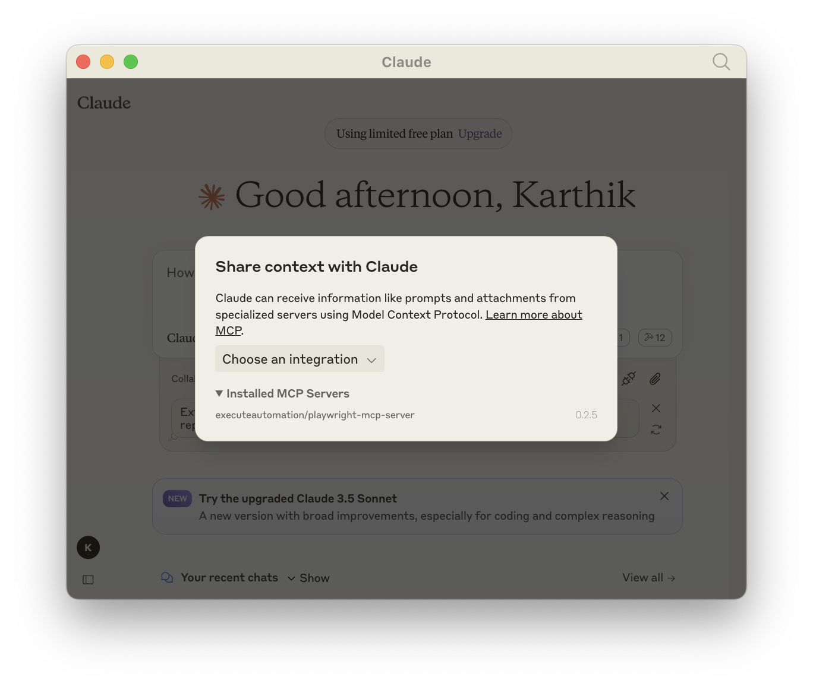

import YouTubeVideoEmbed from '@site/src/components/HomepageFeatures/YouTubeVideoEmbed';

# Playwright MCP Server

The **Playwright Model Context Protocol (MCP) server** is a powerful solution for automating Browser and API testing using Playwright.

With the Playwright MCP server, you can:
	- Enable LLMs to interact with web pages in a real browser environment.
	- Perform tasks such as executing JavaScript, taking screenshots, and navigating web elements.
	- Seamlessly handle API testing to validate endpoints and ensure reliability.
	- Test across multiple browser engines including Chromium, Firefox, and WebKit.




## Installation
You can install Playwright MCP Server package using either **npm**, **mcp-get**, or **Smithery**:

:::info Playwright MCP Tips

To get started more quickly on Playwright MCP Server, watch the videos mentioned in the footer of this page under `Docs`

:::


### Installing via NPM
To install Playwright MCP for Claude Desktop automatically via Smithery:

```bash
npm install -g @executeautomation/playwright-mcp-server
```

### Installing via Smithery
To install Playwright MCP for Claude Desktop automatically via Smithery:

```bash
npx @smithery/cli install @executeautomation/playwright-mcp-server --client claude
```

You can type this command into Command Prompt, Powershell, Terminal, or any other integrated terminal of your code editor.

### Installing via MCP-GET
To install Playwright MCP for Claude Desktop automatically via Smithery:

```bash
npx @michaellatman/mcp-get@latest install @executeautomation/playwright-mcp-server
```

### Configuring Playwright MCP in Claude Desktop 
Here's the Claude Desktop configuration to use the Playwright MCP server.

Modify your `claude-desktop-config.json` file as shown below

```json
{
  "mcpServers": {
    "playwright": {
      "command": "npx",
      "args": ["-y", "@executeautomation/playwright-mcp-server"]
    }
  }
}
```

### What is Model Context Protocol
This video should give you an high level overview of what Claude's MCP is and how helpful it will soon become for AI agents

<YouTubeVideoEmbed videoId="hGJQMbpsTi4" />

## 🟢 Real-Time Event Streaming (SSE)

Playwright MCP Server now supports real-time event streaming via Server-Sent Events (SSE).

- The server exposes an SSE endpoint at `http://localhost:3001/events`.
- You can connect to this endpoint using any SSE-compatible client (such as EventSource in the browser or curl).
- Events are sent in real-time as they occur (e.g., new console logs, screenshots, etc.).

**Example (JavaScript):**
```js
const evtSource = new EventSource('http://localhost:3001/events');
evtSource.addEventListener('console_log_entry', (event) => {
  const data = JSON.parse(event.data);
  console.log('Console log:', data.log);
});
evtSource.addEventListener('screenshot', (event) => {
  const data = JSON.parse(event.data);
  console.log('Screenshot event:', data);
});
```

**Available Events:**
- `console_log_entry`: Fired when a new console log is captured.
- `console_logs`: Fired when all logs are requested.
- `screenshot`: Fired when a screenshot is taken or requested.

This allows you to build real-time dashboards, monitoring tools, or simply observe browser activity as it happens.
