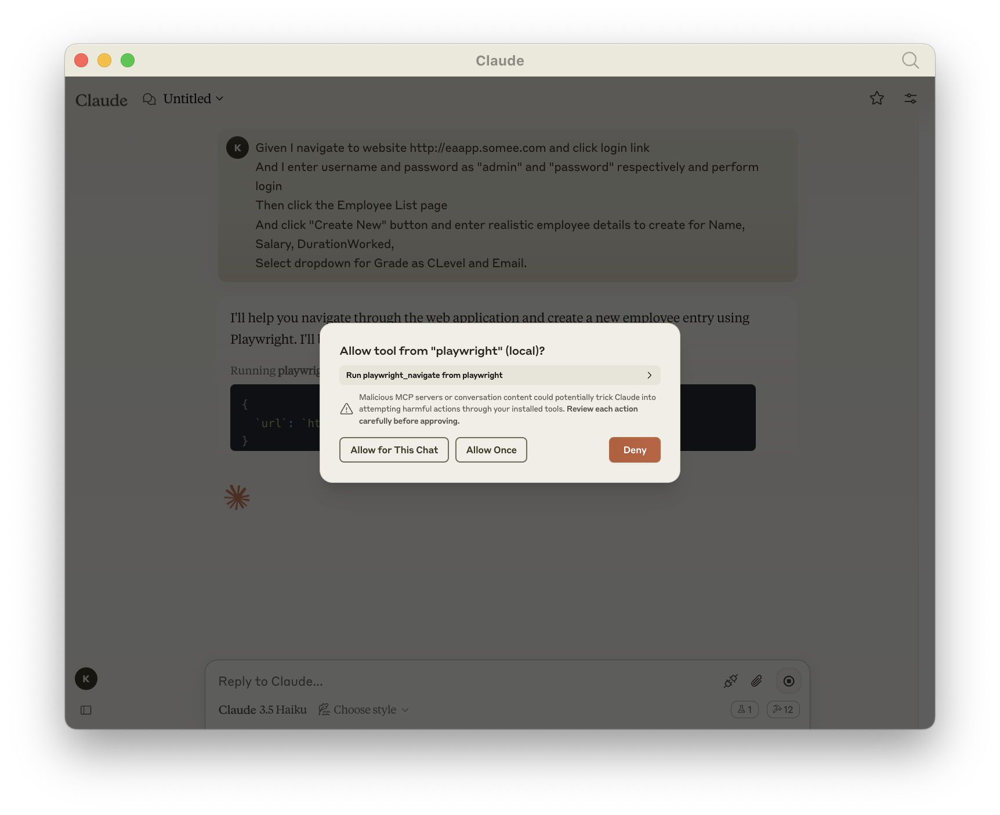
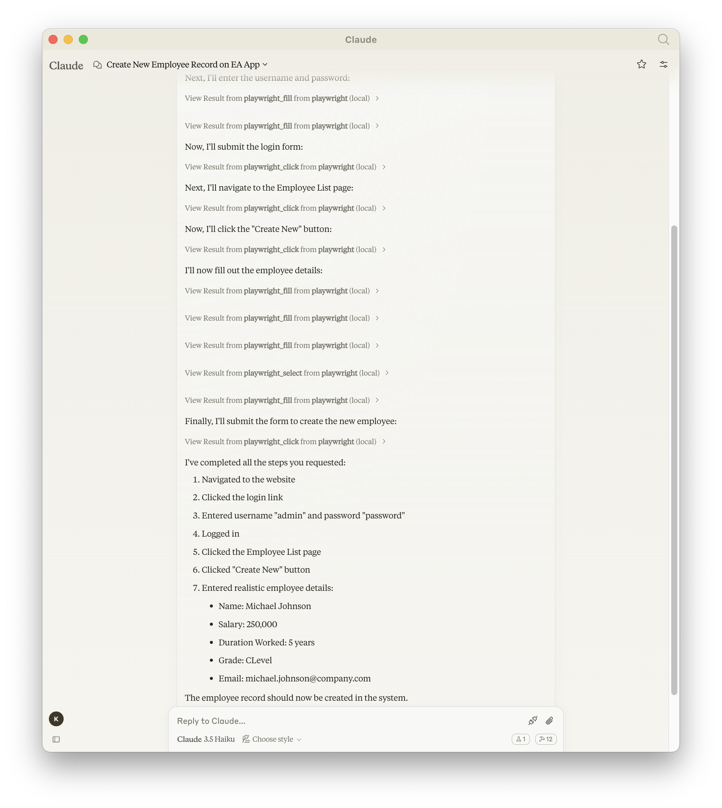

# 🌐 Examples of browser automation
Lets see how we can use the power of Playwright MCP Server to automate our browser and do webscrapping

### Using Different Browser Types

Playwright MCP now supports multiple browser engines. You can choose between Chromium (default), Firefox, and WebKit:

```bdd
Given I navigate to website "https://example.com" using the "firefox" browser
And I take a screenshot named "firefox-example"
Then I navigate to website "https://example.com" using the "webkit" browser 
And I take a screenshot named "webkit-example"
```

When you send these commands to Claude, it will open the website in Firefox first, take a screenshot, then switch to WebKit and take another screenshot, allowing you to compare how different browsers render the same website.

### Scenario in BDD Format
```bdd
Given I navigate to website http://eaapp.somee.com and click login link
And I enter username and password as "admin" and "password" respectively and perform login
Then click the Employee List page 
And click "Create New" button and enter realistic employee details to create for Name, Salary, DurationWorked,
Select dropdown for Grade as CLevel and Email.
```

Once I enter the above text in ***Claude Desktop Client*** I should see Claude desktop giving me prompt to perform operation 
by opening real browser like this



And once the entire test operation completes, we will be presented with the entire details of how the automation did happened.



### Using Browser History Navigation

You can navigate through the browser's history using the new navigation controls:

```bdd
Given I navigate to website "https://example.com"
When I navigate to website "https://example.com/about"
And I navigate back in browser history
Then the current page should be "https://example.com"
When I navigate forward in browser history
Then the current page should be "https://example.com/about"
```

### Using Drag and Drop Functionality

You can drag and drop elements using the new drag tool:

```bdd
Given I navigate to website "https://example.com/drag-drop-demo"
When I drag element with id "draggable" to element with id "droppable"
Then I should see confirmation message "Dropped!"
```

### Using Keyboard Interactions

You can simulate keyboard presses with the new keyboard tool:

```bdd
Given I navigate to website "https://example.com/form"
When I focus on the input field with id "search-box"
And I press the "Enter" key
Then the search results should appear
```

### Saving Page as PDF

You can save the current page as a PDF file:

```bdd
Given I navigate to website "https://example.com/report"
When I save the current page as a PDF in "/downloads" folder with name "report.pdf"
Then I should see confirmation that the PDF was saved
```

Advanced example with custom options:

```bdd
Given I navigate to website "https://example.com/invoice"
When I save the page as PDF with the following settings:
  | Setting          | Value     |
  | ----------------- | --------- |
  | Output Path      | /downloads |
  | Filename         | invoice.pdf |
  | Format           | Letter    |
  | Print Background | true      |
  | Top Margin       | 2cm       |
  | Right Margin     | 1cm       |
  | Bottom Margin    | 2cm       |
  | Left Margin      | 1cm       |
Then I should see confirmation that the PDF was saved
```

### Extracting Page Content

You can extract visible text content from the page:

```bdd
Given I navigate to website "https://example.com/article"
When I extract all visible text from the page
Then I should see the article content in plain text without hidden elements
```

You can also get the complete HTML of the page:

```bdd
Given I navigate to website "https://example.com/products"
When I extract the HTML content of the page
Then I should receive the complete HTML structure of the page
```

You can also filter HTML content for easier analysis:

```bdd
Given I navigate to website "https://example.com/products"
When I extract the HTML content of the page filtered to remove scripts and styles
Then I should receive clean HTML without JavaScript or CSS code

Given I navigate to website "https://example.com/products"
When I extract the HTML content of the page filtered to remove meta tags
Then I should receive HTML without metadata like charset, viewport, and SEO tags

Given I navigate to website "https://example.com/products"
When I extract the HTML content using the cleanHtml option
Then I should receive a clean version of the HTML without scripts, styles, comments, and meta tags

Given I navigate to website "https://example.com/products"
When I extract only the HTML for the main product container using selector "#product-listings"
Then I should receive just the HTML for the products section for easier analysis
```

Example use case for content analysis:

```bdd
Given I navigate to website "https://example.com/pricing"
When I extract all visible text from the page
Then I should be able to analyze the text to find pricing information
And I can determine if the "Enterprise" plan mentions "custom pricing"
```